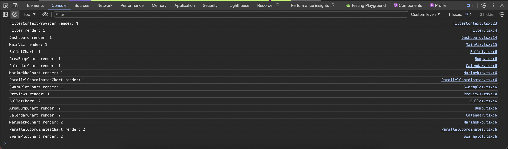
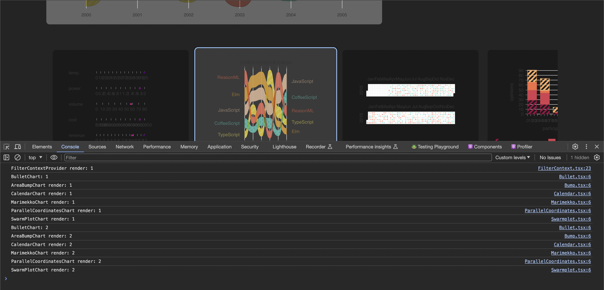
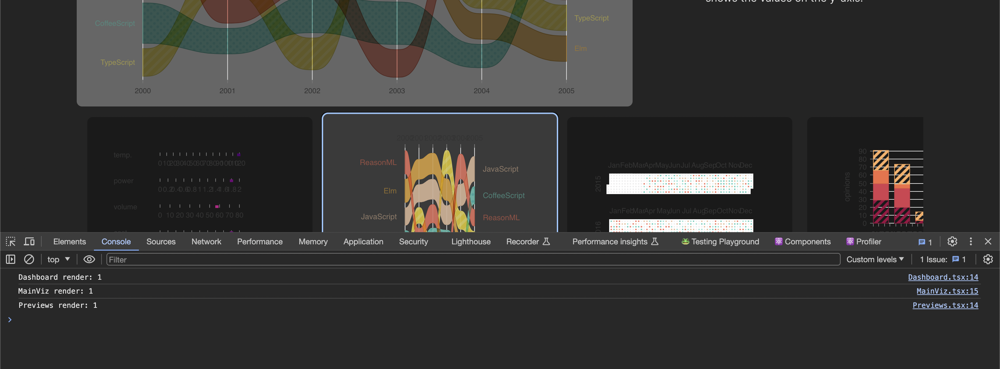
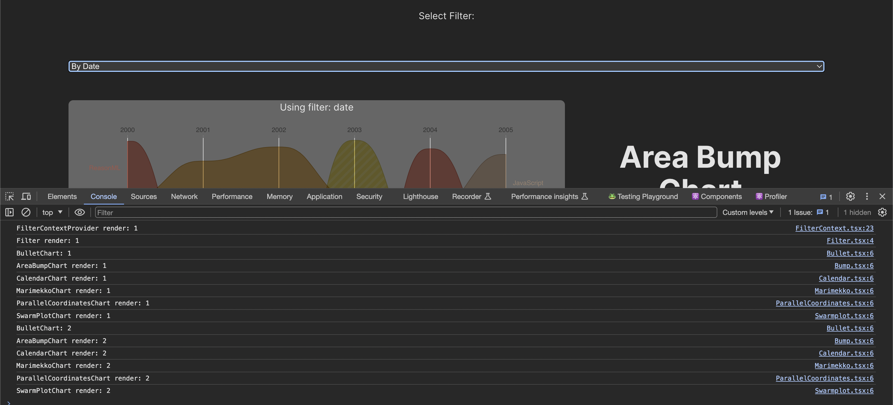

# Dashboad re-renders

## Of re-renders and other demons

Let's think about a feature where you have to display a main visualization and a preview list of all visualizations available, you can select which viz is going to be the main one.
In the main viz part only the selected one is going to be visible but the other ones are hidden using CSS (for demo purposes).
In the preview section, all visualizations are displayed.

How would a simple code for that like?

```
function App() {
  const [currentViz, setCurrentViz] = useState(0);

  const visualizations = [
    {
      chart: <BulletChart />,
      title: "Bullet Chart",
      description: "...",
    },
    {
      chart: <AreaBumpChart />,
      title: "Area Bump Chart",
      description: "...",
    },
    {
      chart: <CalendarChart />,
      title: "Calendar Chart",
      description: "...",
    },
    {
      chart: <MarimekkoChart />,
      title: "Marimekko Chart",
      description: "...",
    },
    {
      chart: <ParallelCoordinatesChart />,
      title: "Parallel Coordinates Chart",
      description: "...",
    },
    {
      chart: <SwarmPlotChart />,
      title: "Swarm Plot Chart",
      description: "...",
    },
  ];

  return (
    <main className="layout">
      {/* MainViz section */}
      <section>
        {visualizations.map((item, idx) => (
          <section
            key={item.title + idx}
            data-hidden={currentViz !== idx}
            className="chart-container"
          >
            <div className="chart">{item.chart}</div>
            <div className="chart-info">
              <h1>{item.title}</h1>
              <p>{item.description}</p>
            </div>
          </section>
        ))}
      </section>

      {/* Previews section */}
      <section className="preview-container">
        {visualizations.map((item, idx) => (
          <button
            key={item.title + idx}
            data-highlighted={currentViz === idx}
            className="preview-selector"
            onClick={() => setCurrentViz(idx)}
          >
            <div className="chart-preview">{item.chart}</div>
          </button>
        ))}
      </section>
    </main>
  );
}
```

Let's see what this app renders (This is and advanced version adding console.count to count the times a component renders)



As you can notice, charts are rendered twice, it is ok, one for the preview, the other one for the main viz. There are more components there but those are not relevant for this part of the example.

Simple right? you create a list of widgets to display them in a dashboard-like way, add a state to handle the selected visualization and each section is in charge of rendering the charts. Nothing special so far, but you start noticing when you select a viz, everything is re-rendered and if the charts are resource-consuming components, that is not good.



We just changed a number in a state and now all charts are being re-rendered again when it should just be hide and show elements.

At this moment, you may be asking one of the most controversial questions in React, how can I avoid or minimize unnecessary re-renders?

Let's think about it? what do you think?

Are thinking about `React.memo`? 

and the answer is NO! Sorry, it was not my intention to destroy what you learned from a random blog. `React.memo` is the last, LAST, resource when you want to avoid unnecessary re-renders.

But why?

Re-renders are a core principle of React. It is the way to keep the UI up to date with the state, it is not bad. What is bad is slow renders!!

So first of all, fix slow renders, then fix unnecessary re-renders.

But now you may be asking, ok, I have fixed slow renders, how do I fix unnecessary re-renders?

And the answer is: `COMPOSITION`

## React composition

The way React works with components, as simple as it is, it is composition for UI. And what does that mean? you can create small and reusable components, combining them to create larger and more complex components.

But, how does that solve the re-render issue?

Ok, let's think about how you dispatch a re-render in React, and it is simpler as setting new a state using the useState hook in the component. When you call `setSomething`, a new state is set and the component will trigger a re-render to be up to date with the new state. That means the components depend on the new state to be updated and everything that is an internal part of the component will be tied to that state. Remember this part, it is really important.

Ok ok, I got the idea of the state and the component and its internal structure depending on that state, but, how does that will help me avoid unnecessary re-renders?

It is important to understand how the state works because that is relevant to get the idea of composition. Ready to implement composition?

So, let's think about how the state is affecting the components, in our component is `const [currentViz, setCurrentViz] = useState(0)`. Is that state needed to render the visualization? Is the state key to get an updated version of each chart? The answer is `NO`.

Why and where do we need `[currentViz, setCurrentViz]`? we need that state to show something in the main viz section and select something from the preview section. So let's create a component responsible to select the current visualization. To help with this example we are creating two more components `MainViz.tsx` and `Previews.tsx`.

This composition pattern is called `move the state down`. Create a smaller component where the render is affected only by its inner state. Let's create the component in `Dashboard.tsx` that will be responsible of handling the current viz state.

Hey, but what about the visualizations array? Well, that is where the "magic" starts. Remember I mentioned the state only affects the internal parts of the components? Re-renders DO NOT affect properties, including children!!

Wow! that is amazing!!

Properties and children are external parts of the component.


So, we are passing in the visualizations as props.

```
function Dashboard({
  visualizations,
}: {
  visualizations: {
    chart: JSX.Element;
    title: string;
    description: string;
  }[];
}) {
  const [currentViz, setCurrentViz] = useState(0);
  return (
    <section>
      <MainViz currentViz={currentViz} visualizations={visualizations} />
      <Previews
        currentViz={currentViz}
        setCurrentViz={setCurrentViz}
        visualizations={visualizations}
      />
    </section>
  );
}

```
and now it is time to use it!

```

const visualizations = [
  {
    chart: <BulletChart />,
    title: "Bullet Chart",
    description: "...",
  },
  ...
]
  
<main className="layout">
  <Dashboard visualizations={visualizations} />
</main>
```

Ready to take a look at the re-renders?



That is great!! only dashboard, main viz and previews components are re-rendered! We were able to fix the unnecessary re-render issue only with composition!

Isn't it great!? you can take control of what you want to re-render moving the state down and passing in components as props and children.

But, what if we want to add a filter to change the data for each visualization?

Let's say we add a filter prop like this to the charts

```
const BulletChart = ({ filter }: { filter: string }) => {
  return (
    <>
      <span>{filter ? `Using filter: ${filter}` : ""}</span>
      <ResponsiveBullet
        ...
      />
    </>
  );
};
```

and now, we add a new state to control the current filter state like this.

```
const [filter, setFilter] = useState("");

const visualizations = [
  {
    chart: <BulletChart filter={filter} />,
    title: "Bullet Chart",
    description: "...",
  },
  ...
]
  
<main className="layout">
  <p>Select Filter:</p>
  <select value={filter} onChange={(e) => setFilter(e.target.value)}>
    <option value="">No filter</option>
    <option value="date">By Date</option>
    <option value="name">By Name</option>
    <option value="range">By Range</option>
  </select>
  <Dashboard visualizations={visualizations} />
</main
```

Now we have an "issue", what is the problem here?

The filters are set by `setFilter` and that triggers a re-render, and that is ok because you need to re-render the charts, create again the visualization array and pass them in again to the dashboard. But if you think about it, the charts are the ones needing `filter` state. Dashboard is not depending on the filter to be render. If we were not using composition, that would look like `prop-drilling`, passing the filter to dashboard, dashboard to main viz and previews, and those two components passing the filter to the charts. So in theory we would be re-rendering dashboard, main viz, and previews just to prop drill a filter. Same problem here with the composition. Visualization prop is not affected by filter state. Now we are seeing the issue here, a state causing unnecessary re-renders in dashboard, main viz, and previews.

How can we solve it?

It would be good to have some sort of reactivity, right? Like signals in some frameworks, like Qwik, Solid or Angular, or Runes in Svelte, maybe refs in Vue.

Let me tell you a secret, come here. React has its own reactivity way, a React way and it is called `CONTEXT API`

## React Context and Composition

React context is a great way to add reactivity to your code. You don't need to add an external library (unless you have a really complex use case where you need an external library to add reactivity)

Here it comes one of the trickiest questions about Context. How can we have reactivity if a context provider re-renders the tree? Does context change trigger re-renders?

And the answer is `YES` and `NO`.

As I mentioned, re-renders are a core principle of React and that is its way to keep the UI up to date. But if you implement composition in the provider, you will avoid re-renders.

Ready to see it in action? Let's take a look.

First, create the context, the hook to re-use the logic, and the provider component.

```
const FilterContext = createContext<{
  filter: string;
  setFilter: React.Dispatch<React.SetStateAction<string>>;
} | null>(null);

function useFilterContext() {
  const context = useContext(FilterContext);
  if (!context) {
    throw new Error(
      "Filter inner components cannot be used outside the Filter Context Provider Component"
    );
  }
  return context;
}

function FilterContextProvider({
  children,
}: {
  children: React.ReactNode;
}) {
  const [filter, setFilter] = useState("");
  return (
    <FilterContext.Provider value={{ filter, setFilter }}>
      {children}
    </FilterContext.Provider>
  );
}
```

Focus on `FilterContextProvider`, you are wrapping children inside `FilterContext.Provider` so when the filter state changes, only the context provider will be re-rendered but children not. That is great!

It is time to use the context. We will be able to access the filter state adding the `useFilterContext` to the charts:

```
const BulletChart = () => {
  // remove prop, use context
  const { filter } = useFilterContext();

  return (
    <>
      <span>{filter ? `Using filter: ${filter}` : ""}</span>
      <ResponsiveBullet
        ...
      />
    </>
  );
};
```

Then, create a filter component in charge of selecting the current filter. We can access the state and the setter.

```
function Filter() {
  const { filter, setFilter } = useFilterContext();

  return (
    <>
      <p>Select Filter:</p>
      <select value={filter} onChange={(e) => setFilter(e.target.value)}>
        <option value="">No filter</option>
        <option value="date">By Date</option>
        <option value="name">By Name</option>
        <option value="range">By Range</option>
      </select>
    </>
  );
}
```

and now, we can clean up our main app and add the context and filter component

```
<main className="layout">
  <FilterContextProvider>
    <Filter />
    <Dashboard visualizations={visualizations} />
  </FilterContextProvider>
</main>
```

Ready to see the logs?



Did you see that? only the charts and the filter component are being re-rendered. Dashboard, main viz, and previews are not. That is a huge improvement.

In conclusion, `React.memo` should not be your first option to avoid unnecessary re-renders. You can achieve a huge performance boost just using composition and adding reactivity with Context. We can add more examples and make our context reactivity even better but it is out-of-scope of this example.

Remember, fix your slow renders first, then fix your re-renders. Use the best feature React has, `COMPOSITION`

One last thought, learn more about react composition, test ideas, play with them and you will be ready when the time comes to you to use `react server components` (RSC). You will have no issue using client and server components, RSC basically is composition for data loading.
